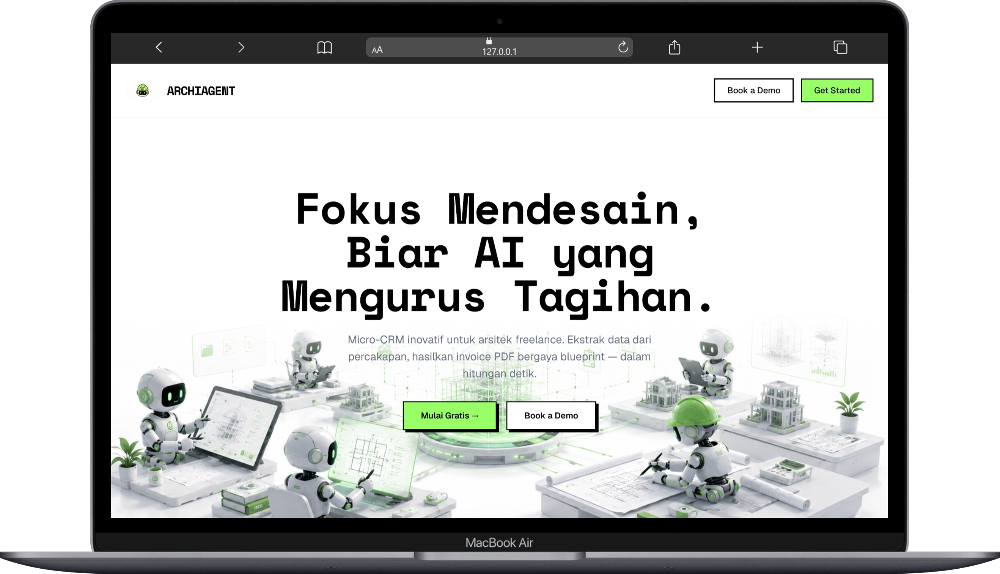

# Archids AI 🏛️🤖

**Archids AI** adalah inovasi Micro-CRM (Customer Relationship Management) berbasis *AI Agent* yang dirancang secara spesifik untuk memecahkan masalah administrasi para arsitek *freelance* dan studio desain. Aplikasi ini mengotomatiskan manajemen klien, proyek, dan penciptaan tagihan (invoice) menggunakan antarmuka *chat* natural layaknya asisten virtual pribadi.

Dibangun sebagai proyek UAS Semester 4, sistem ini mengimplementasikan tumpukan teknologi modern yang sangat efisien, mengandalkan **Laravel 12**, **Livewire v3**, **Tailwind CSS**, dan **Generative AI (DeepSeek-V4-Pro via Featherless.ai)**.

 *(Preview Aplikasi Archids AI)*

---

## 🌟 Mengapa Archids AI Berbeda?

Sebagian besar CRM arsitek berupa *form-based* (berbasis pengisian formulir manual yang membosankan). **Archids AI menggunakan pendekatan *Conversational Interface***. Arsitek cukup "mengobrol" dengan AI menggunakan bahasa sehari-hari:
> *"Tolong buatkan tagihan untuk Pak Budi Santoso, proyek desain rumah minimalis. Termin pertama DP 30%, nominalnya Rp 15.000.000."*

AI akan langsung memahami konteks, mengekstrak data persis ke dalam format JSON *(Function Calling)*, menampilkannya sebagai Kartu Konfirmasi visual, menyimpannya ke *Database* relasional, dan seketika mencetaknya dalam bentuk dokumen **PDF Blueprint-Style** yang estetik.

---

## ✨ Fitur Utama & Arsitektur Sistem

### 1. 🤖 AI Chat Assistant Terintegrasi (Function Calling)
- **Model Mutakhir**: Menggunakan `DeepSeek-V4-Pro` dari endpoint Featherless.ai untuk pemahaman konteks tingkat tinggi dalam Bahasa Indonesia.
- **Sliding Window Memory**: Mengirimkan hanya $N$-pesan terakhir (default: 20) untuk menjaga AI tetap fokus pada konteks saat ini tanpa menguras limit token.
- **Structured Data Extraction**: Memanfaatkan instruksi *Function Calling* (`prepare_invoice_draft`) yang memaksa AI merespons dengan JSON murni, bukan teks naratif. JSON ini langsung dipetakan oleh aplikasi ke *array* PHP.

### 2. ⚡ Livewire v3 Clean Workspace UI
- **Clean Minimalist Design (Light Theme)**: Antarmuka bergaya *Notion-style* yang cerah (`bg-white` & `slate` tones), memberikan kesan workspace profesional yang bersih, modern, dan sangat mudah dibaca.
- **Context-Aware Header & Sidebar**: Terdapat Sidebar untuk manajemen multi-proyek, serta *Context Chips* di bagian atas chat yang secara dinamis menampilkan Klien, Proyek, dan Status aktif saat ini.
- **Quick Actions & Templates**: Layar beranda chat dilengkapi dengan tombol aksi cepat (Upload PDF RAB, Buat Draft Invoice) dan *Prompt Templates* untuk mempercepat kerja.
- **In-App PDF Preview Modal**: Sistem dilengkapi modal internal untuk mem-*preview* PDF invoice yang telah dibuat secara langsung di dalam workspace tanpa harus berpindah halaman.
- **Asynchronous Processing**: Dilengkapi indikator mengetik animasi (typing indicator) dan pembekuan tombol input saat AI sedang memproses (*loading states*) tanpa reload halaman.

### 3. 📄 Blueprint-Style PDF Generation (Laravel DomPDF)
- Sistem me-render invoice menggunakan `barryvdh/laravel-dompdf`.
- **Desain Monospace Minimalist**: Untuk memastikan tata letak presisi saat diekspor ke PDF, desain *tidak* menggunakan Flexbox/Grid CSS modern (yang kurang stabil pada PDF renderer), melainkan tabel HTML berstruktur tingkat tinggi dengan tata letak *inline-CSS*.
- **Branding Dinamis**: Memuat konfigurasi personalisasi arsitek dari database (Tabel `invoice_settings`), seperti logo studio, warna aksen (`primary_color`), dan syarat pembayaran (*payment terms*).

### 4. 🗄️ Relasional Database Management (MySQL)
Sistem database menggunakan Eloquent ORM Laravel dengan skema tangguh (dilengkapi *Cascade Deletion*):
- `users`: Data autentikasi arsitek.
- `invoice_settings`: Personalisasi PDF (1-to-1 dengan users).
- `clients`: Direktori klien (1-to-Many dengan users).
- `projects`: Data proyek (1-to-Many dengan clients).
- `invoices`: Catatan tagihan (1-to-Many dengan projects).

Aplikasi dibekali mekanisme **Auto-Fallback**: Jika nama klien atau proyek yang diekstrak AI belum pernah ada di database, sistem menggunakan fungsi `firstOrCreate()` Laravel untuk merelasikan semuanya secara instan dalam 1 klik konfirmasi.

---

## 🛠️ Tech Stack & Ekosistem

| Lapisan | Teknologi | Penjelasan OOP / Desain |
|---|---|---|
| **Backend Framework** | **Laravel 12 (PHP 8.2+)** | Framework PHP generasi terbaru. Stabil, cepat, dan sangat berorientasi objek. |
| **Frontend UI/UX** | **Livewire v3 & Tailwind CSS** | Memungkinkan interaktivitas layaknya Vue/React hanya dengan menulis PHP & HTML Blade. |
| **Database** | **MySQL** | Relasional, kuat, dan tangguh untuk data finansial (invoice). |
| **AI Integration** | **Guzzle (Laravel HTTP Client)** | 💡 **Arsitektur Service & Adapter**: Kode AI kami bungkus dalam `app/Services/ArchiAIService.php`. Alih-alih memakai SDK *third-party* yang berat, kami memakai native HTTP client untuk men-*decouple* aplikasi dari limitasi *library* luar, sehingga lebih tahan terhadap *bug/quirks* API. |
| **PDF Renderer** | **laravel-dompdf** | Ekspor HTML Blade ke file `.pdf`. |

---

## 🚀 Panduan Instalasi Lokal

### 1. Prasyarat Sistem
- PHP >= 8.2 (Pastikan ekstensi `zip`, `dom`, `gd`, `fileinfo` aktif)
- Composer
- MySQL Database Engine (cth: XAMPP, Laragon, DBngin)
- Node.js & NPM (Opsional untuk Tailwind hot-reload)

### 2. Kloning & Persiapan
```bash
# Clone repositori
git clone https://github.com/wmaulanaaishq/Archids-AI.git
cd Archids-AI

# Install seluruh dependensi PHP backend
composer install
```

### 3. Konfigurasi Environment (`.env`)
Copy file `.env.example` menjadi `.env`.
```bash
cp .env.example .env
php artisan key:generate
```
Sesuaikan parameter database dan kredensial AI di dalam file `.env`:
```env
DB_CONNECTION=mysql
DB_HOST=127.0.0.1
DB_PORT=3306
DB_DATABASE=archiagent_db # Anda harus membuat db kosong ini di MySQL terlebih dahulu
DB_USERNAME=root
DB_PASSWORD=

# Kredensial AI Model (Featherless.ai Endpoint)
OPENAI_API_KEY=your_featherless_api_key_here
OPENAI_BASE_URL=https://api.featherless.ai/v1
OPENAI_REQUEST_TIMEOUT=60

# Konfigurasi Memori Archids AI
ARCHIAI_MODEL=deepseek-ai/DeepSeek-V4-Pro
ARCHIAI_MAX_HISTORY=20
```

### 4. Migrasi Database & Seeding
```bash
# Eksekusi seluruh skema tabel 
php artisan migrate

# (Sangat Dianjurkan) Tambahkan data user dan tabel settings dasar:
mysql -u root archiagent_db -e "INSERT INTO users (id, name, email, password, created_at, updated_at) VALUES (1, 'Arsitek Demo', 'demo@archiagent.test', 'password', NOW(), NOW());"
```

### 5. Jalankan Aplikasi
```bash
php artisan serve
```
Akses di browser Anda: `http://127.0.0.1:8000`

---

## 🔄 Roadmap Pengembangan Fasa
Proyek ini melalui 4 fase (*Milestones*) eksekusi terstruktur:
1. ✅ **Fase 1 (Infrastruktur Database)**: Desain arsitektur tabel relasional, implementasi ORM `belongsTo` & `hasMany` dengan integritas referensial *(Cascade onDelete)*.
2. ✅ **Fase 2 (Sistem Kecerdasan Buatan)**: Re-engineering `ArchiAIService` menggunakan HTTP facade. Evaluasi respons API `tool_calls` model *DeepSeek*.
3. ✅ **Fase 3 (Visualisasi Reaktif)**: Konstruksi kelas komponen SPA *Livewire* (`ChatWorkspace`). Pembuatan UI *Clean Minimalist*, manajemen memori percakapan, integrasi Modal Preview PDF, dan validasi *Draft Invoice*.
4. ✅ **Fase 4 (Export Pipeline)**: Injeksi *Controller* `download()` dan konversi elemen *DOM* Blade menuju layout standar *print-architect* murni PDF.

---
*Dibuat oleh W. Maulana Aishq — Solusi Mikro Administrasi Digital Arsitektur.*
